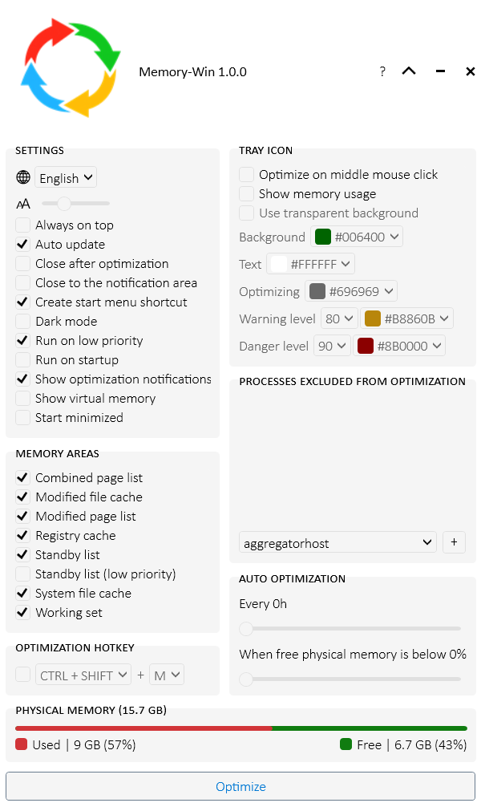
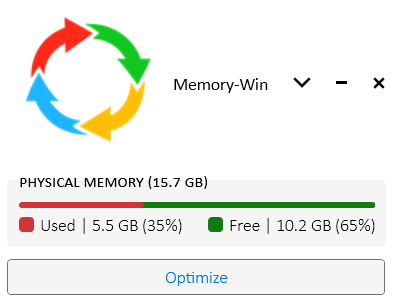
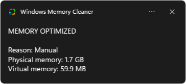
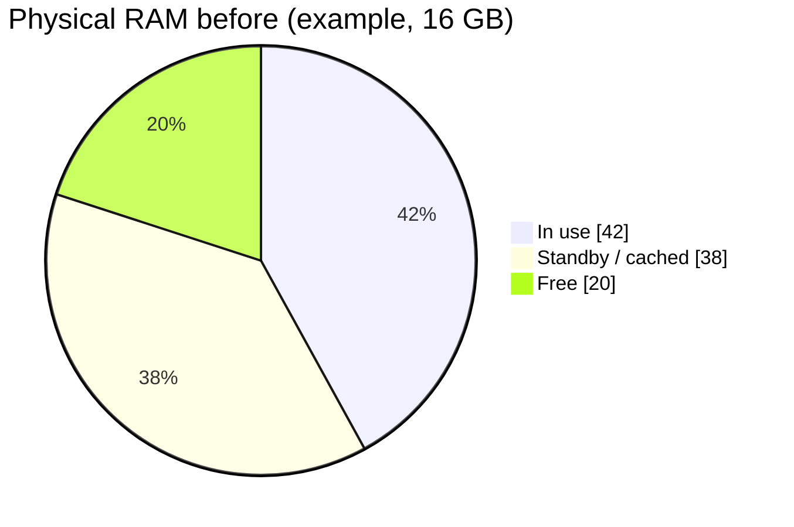
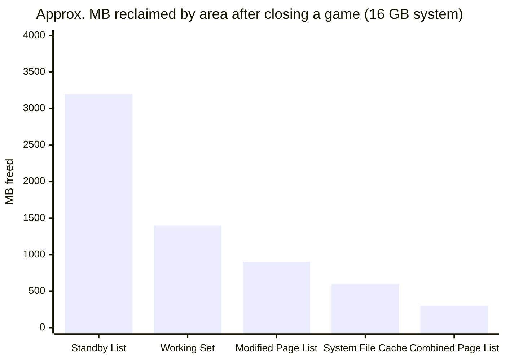
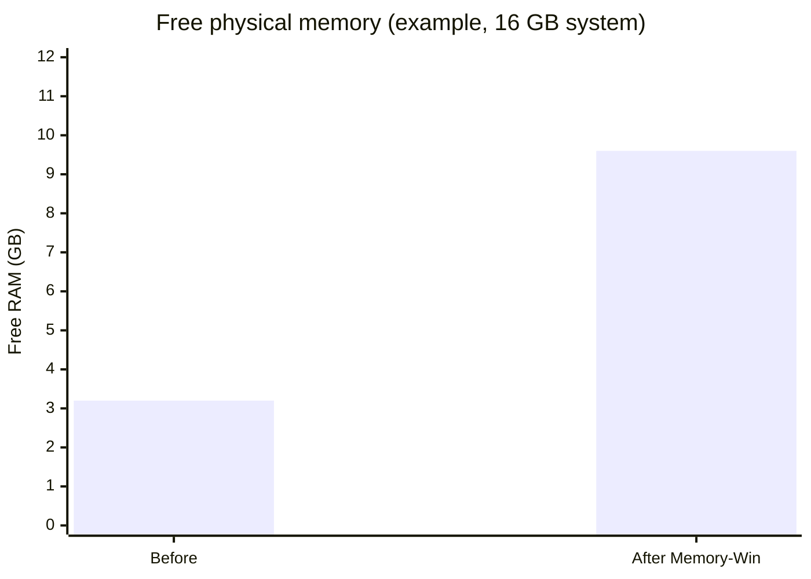
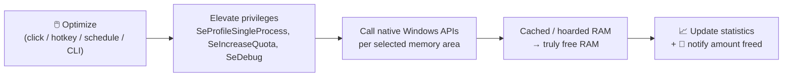
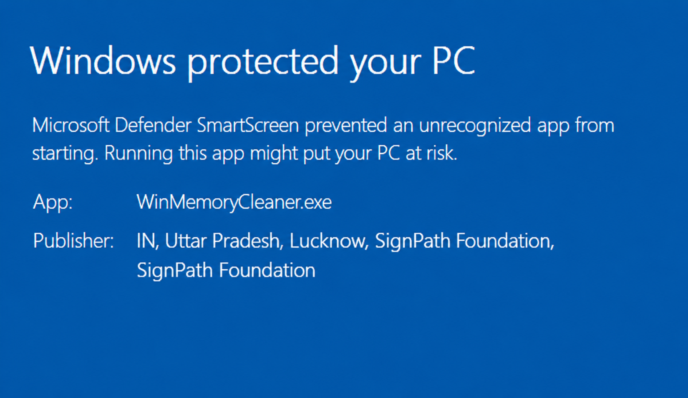
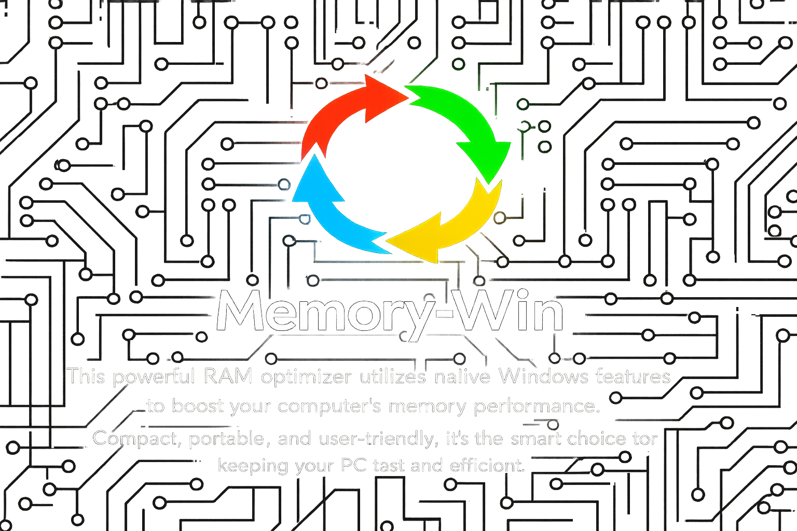

<div align="center">


# Memory-Win

### ⚡ A fast, transparent, native Windows RAM optimizer — no snake oil, just documented Windows APIs.

[](https://github.com/Aditya060806/Memory-Win/releases/latest)
[](https://github.com/Aditya060806/Memory-Win/releases)
[](/LICENSE)
[](https://github.com/Aditya060806/Memory-Win/actions/workflows/ci.yml)

[](#-requirements)
[](#-requirements)
[](#-architecture)
[](#-architecture)

<p>
  <a href="#-download--build"><b>⬇️ Download</b></a> &nbsp;·&nbsp;
  <a href="#-efficiency--benchmarks"><b>📊 Efficiency</b></a> &nbsp;·&nbsp;
  <a href="#-how-it-compares"><b>⚖️ Comparison</b></a> &nbsp;·&nbsp;
  <a href="#-how-it-works"><b>🧬 How it works</b></a> &nbsp;·&nbsp;
  <a href="#-command-line--automation"><b>🖥️ CLI</b></a>
</p>



</div>

---

## 💡 What is Memory-Win?

**Memory-Win** is a free, open-source, **portable single-executable** utility that reclaims wasted RAM on Windows by calling the same **documented, native Windows APIs** the operating system uses internally — nothing hidden, nothing hacky, no bundled bloat.

It's built for the machines most people actually run: the **8 GB laptop**, the **16 GB gaming rig**, and the developer juggling VMs and 80 browser tabs. When apps hoard memory or the standby cache fills up, Memory-Win frees it **on demand** so your next task gets the RAM it needs — instantly.

> 🪶 **Zero third-party dependencies · No installation · No telemetry · One `.exe`.**

---

## 📑 Table of Contents

- [Screenshots](#-screenshots)
- [Features](#-features)
- [Efficiency & Benchmarks](#-efficiency--benchmarks)
- [How It Compares](#-how-it-compares)
- [How It Works](#-how-it-works)
- [Proof of Concept](#-proof-of-concept)
- [Download / Build](#-download--build)
- [Command-Line & Automation](#-command-line--automation)
- [Themes & Statistics](#-themes--statistics)
- [Settings & Storage](#-settings--storage)
- [Requirements](#-requirements) · [Architecture](#-architecture)
- [Localization](#-localization)
- [Troubleshooting](#-troubleshooting)
- [Contributing](#-contributing) · [License](#-license)

---

## 🖼️ Screenshots

<table>
  <tr>
    <td align="center" width="50%">
      <br/>
      <sub><b>Main window</b> — pick memory areas and optimize</sub>
    </td>
    <td align="center" width="50%">
      <br/>
      <sub><b>Compact mode</b> — minimal at-a-glance monitor</sub>
    </td>
  </tr>
  <tr>
    <td align="center" colspan="2">
      <br/>
      <sub><b>Notification</b> — shows RAM freed + your running total reclaimed</sub>
    </td>
  </tr>
</table>

---

## ✨ Features

| Feature | What it does |
|:---|:---|
| 🧹 **One-click optimize** | Reclaim RAM instantly from 8 targeted memory areas. |
| 🌗 **Dark / Light theme** | Live-switching, persisted theme — modern look, zero lag. |
| 📈 **RAM-reclaimed statistics** | Tracks lifetime optimizations and **total memory reclaimed**, shown after every run. |
| ⏱️ **Auto-optimization** | Trigger by interval (every *X* hours) or when free RAM drops below a threshold. |
| ⌨️ **Global hotkey** | Optimize from anywhere (default `Ctrl + Shift + M`), toggleable. |
| 🔔 **Smart notifications** | See the reason and the amount of RAM freed after each run. |
| 🖥️ **Tray icon** | Live memory-usage readout, color thresholds, middle-click to optimize. |
| 🚫 **Process exclusion list** | Protect critical apps from working-set trimming. |
| 🪶 **Compact mode** | Collapse to a minimal at-a-glance monitor. |
| 🏃 **Run on startup / low priority** | Autostart via Task Scheduler; optional low-priority mode to avoid freezes. |
| 🧰 **Console & Service modes** | Silent CLI optimization and a background Windows Service. |
| 🌐 **30+ languages** | Full right-to-left (RTL) and bidirectional text support. |

---

## 📊 Efficiency & Benchmarks

Memory-Win converts **cached / hoarded** memory back into **truly free** memory. The charts below are **illustrative examples** measured with Windows Resource Monitor on a 16 GB system after closing a large game — *your results depend on your hardware and workload.*

**Physical RAM composition — before optimization**



**RAM reclaimed per memory area (example)**



**Free RAM: before vs after**



> ✅ **Verify it yourself** — see the [Proof of Concept](#-proof-of-concept) below. Memory-Win never fabricates results; it reports exactly how much *free physical memory* changed, straight from the Windows API.

---

## ⚖️ How It Compares

|  | 🟢 **Memory-Win** | 🔴 Typical "RAM booster" | 🟡 Manual (Task Manager) |
|:---|:---:|:---:|:---:|
| Uses documented native Windows APIs | ✅ Yes | ❌ Undocumented tricks | ✅ Yes |
| Frees the **Standby List** (cached RAM) | ✅ Yes | ⚠️ Rarely | ❌ No |
| Trims **working sets** across processes | ✅ Yes | ⚠️ Sometimes | ❌ No (per-process only) |
| Open source & auditable | ✅ Yes | ❌ No | — |
| Third-party dependencies | ✅ **None** | ❌ Many / bundled ads | — |
| Portable single `.exe` | ✅ Yes | ❌ Installer + services | — |
| Telemetry / ads | ✅ **None** | ❌ Common | — |
| Automation (CLI / Service) | ✅ Yes | ⚠️ Limited | ❌ No |
| Lifetime reclaimed statistics | ✅ Yes | ❌ No | ❌ No |
| Cost | 🆓 Free | 💲 Freemium / paid | 🆓 Free |
| RAM footprint | 🪶 Tiny (native .NET 4.0) | 🐘 Heavy | — |

---

## 🧬 How It Works

Memory-Win is a friendly front-end for powerful, **documented Windows API functions**. Each cleaner targets a specific memory area; availability depends on your Windows version.

| Memory Area | Description | Windows | Server |
| :--- | :--- | :---: | :---: |
| **Combined&nbsp;Page&nbsp;List** | Flushes the page-combining list that merges identical memory pages. | 8+ | 2012+ |
| **Modified&nbsp;File&nbsp;Cache** | Flushes the volume file cache to disk for all fixed drives. | XP+ | 2003+ |
| **Modified&nbsp;Page&nbsp;List** | Writes unsaved pages to disk and moves them to the standby list. | Vista+ | 2008+ |
| **Registry&nbsp;Cache** | Flushes registry hives from memory. | 8.1+ | 2012+ |
| **Standby&nbsp;List** | Clears the entire standby list — the biggest source of reclaimable cached RAM. | Vista+ | 2008+ |
| **Standby&nbsp;List&nbsp;(low&nbsp;priority)** | Clears only the lowest-priority cached pages (gentler). | Vista+ | 2008+ |
| **System&nbsp;File&nbsp;Cache** | Trims the cache Windows uses for its own system files. | XP+ | 2003+ |
| **Working&nbsp;Set** | Forces processes to release non-essential RAM (reduces stutter). | XP+ | 2003+ |



---

## 🔬 Proof of Concept

Don't take our word for it — watch it work in **Resource Monitor**:

1. Open Resource Monitor (`resmon.exe`) → **Memory** tab.
2. Note the blue **Standby** bar (cached RAM from closed apps).
3. Open and close a few large apps (a game, a browser) and watch **Standby** grow.
4. In Memory-Win, select **only `Standby List`** and click **Optimize**.
5. Watch **Standby** drop and light-green **Free** rise by the same amount — instantly.

That's the whole trick: **cached memory becomes free memory**, verifiably.

---

## 🚀 Download / Build

Memory-Win needs **administrator privileges** to perform deep memory cleaning (it requests elevation automatically).

### Option A — Download a release ⬇️

Grab the latest **`MemoryWin.exe`** from the [**Releases**](https://github.com/Aditya060806/Memory-Win/releases/latest) page, then right-click → **Run as administrator**. No installation required. Verify integrity with the published `checksums.txt`.

### Option B — Build from source 🛠️ (verified in CI)

Requires **Visual Studio 2022 Build Tools** (MSBuild) + the **NuGet CLI**.

```powershell
# 1. Restore packages
nuget restore src\MemoryWin.sln

# 2. Build (Release). CI=true uses the NuGet .NET 4.0 reference assemblies
#    and skips the admin-only local bootstrap target.
& "C:\Program Files (x86)\Microsoft Visual Studio\2022\BuildTools\MSBuild\Current\Bin\MSBuild.exe" `
    src\MemoryWin.sln /p:Configuration=Release /p:Platform="Any CPU" /p:CI=true
```

Output: `src\bin\Release\MemoryWin.exe`.

```powershell
# 3. (Optional) Run the 339-test suite against the build
src\packages\NUnit.Runners.2.6.4\tools\nunit-console.exe src\bin\Release\MemoryWin.exe
```

---

## 🖥️ Command-Line & Automation

Run these **as administrator**. Combine memory-area flags freely:

```cmd
MemoryWin.exe /StandbyList /WorkingSet /ModifiedFileCache
```

| Flag | Action |
|:---|:---|
| `/CombinedPageList` `/ModifiedFileCache` `/ModifiedPageList` `/RegistryCache` | Optimize that memory area |
| `/StandbyList` **or** `/StandbyListLowPriority` | Clear standby cache (full or gentle) |
| `/SystemFileCache` `/WorkingSet` | Optimize that memory area |
| `/Stats` | Print lifetime stats (optimizations run + total RAM reclaimed) |
| `/Install` / `/Uninstall` | Install / remove the background **Windows Service** |
| `/Reset` | Restore factory defaults (keeps your language) |

**Scheduled silent cleanup:**

```cmd
"C:\Tools\MemoryWin.exe" /StandbyList /WorkingSet
```

**Check how much you've reclaimed over time:**

```cmd
"C:\Tools\MemoryWin.exe" /Stats
```

---

## 🌗 Themes & 📈 Statistics


- **Dark / Light theme** — toggle **Dark mode** in Settings. The switch is live and persisted; the whole UI re-themes instantly, no restart.
- **RAM-reclaimed statistics** — Memory-Win counts every optimization and the **total physical memory reclaimed** over the app's lifetime. The running total appears in the post-optimization notification (right) and via the `/Stats` command. Statistics reset with `/Reset`.

<br clear="right"/>

---

## ⚙️ Settings & Storage

All settings and statistics are stored in the Windows registry at:

```
HKEY_LOCAL_MACHINE\SOFTWARE\MemoryWin
```

To wipe everything back to defaults, run `MemoryWin.exe /Reset` (see [Troubleshooting](#-troubleshooting)).

---

## 🧩 Requirements

- **OS:** Windows XP / Server 2003 and later (up to Windows 11 / Server 2025), 32- or 64-bit.
- **Runtime:** .NET Framework 4.0 (preinstalled on modern Windows).
- **Privileges:** Administrator (required for the memory-management APIs).

### 🏗️ Architecture

- **WPF + MVVM** single-page UI on the legacy **.NET Framework 4.0**.
- **Zero third-party runtime dependencies** — only native Windows APIs (`ntdll`, `psapi`, `kernel32`, `advapi32`).
- Hand-rolled IoC container, embedded-resource localization, and runtime theming.
- Portable: everything ships in one executable.
- **CI/CD:** GitHub Actions builds + runs the full test suite on every push (`ci.yml`), scans with **CodeQL** (`codeql.yml`), and publishes signed-off releases on version tags (`release.yml`).

---

## 🌐 Localization

Memory-Win ships in **30+ languages** with full RTL/bidirectional support. Language files live in [`src/Resources/Localization`](/src/Resources/Localization). New strings use an English baseline until a native translation is contributed — **PRs from native speakers are very welcome** (provide values in lowercase; the app capitalizes for display).

<details>
<summary><b>Supported languages</b></summary>

Albanian · Arabic · Bulgarian · Chinese (Simplified) · Chinese (Traditional) · Dutch · English · French · German · Greek · Hebrew · Hungarian · Indonesian · Irish · Italian · Japanese · Korean · Macedonian · Norwegian · Persian · Polish · Portuguese (Brazil) · Portuguese (Portugal) · Russian · Serbian · Slovenian · Spanish · Thai · Turkish · Ukrainian

</details>

---

## 🛠️ Troubleshooting



**Flagged by antivirus / SmartScreen?** A brand-new, unsigned build has no reputation yet, and creating a startup scheduled task + registry entries can trigger heuristic false positives. This is expected — build from source or verify the release with `checksums.txt`, then allow-list it. As more people run it, the warning fades.

**Reset to factory defaults** (fixes crashes / stuck windows):

```cmd
MemoryWin.exe /Reset
```

**View logs:** All activity is written to the Windows **Event Viewer** → `Windows Logs > Application`, source **Memory-Win**.

<br clear="right"/>

---

## 🤝 Contributing

Contributions are welcome — bug fixes, features, and especially **translations**. Please keep the project's principles intact: native APIs only, no third-party runtime dependencies, and Windows retro-compatibility.

## 📄 License

Released under the [GPL-3.0](/LICENSE) license.

---

<div align="center">



**Built with ❤️ by [Aditya Pandey](https://github.com/Aditya060806)**

⭐ If Memory-Win helps you, consider starring the repo!

</div>
